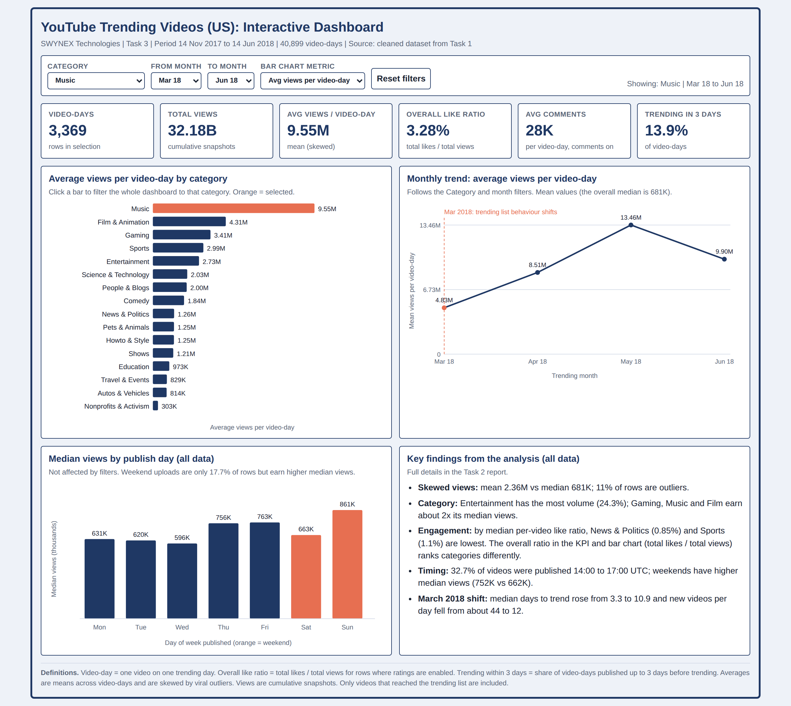
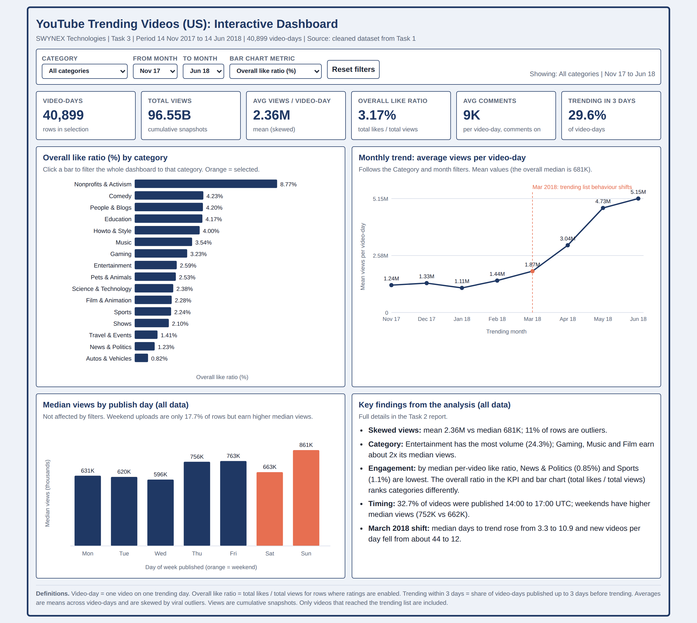
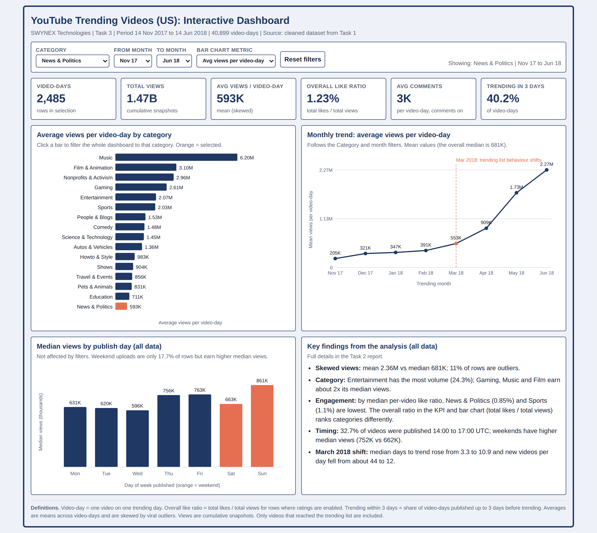

# SWYNEX Final Data Analytics Project

## YouTube Trending Videos (US): Analysis and Dashboard

This is my final project for the Data Analytics internship at SWYNEX Technologies. It brings together my earlier tasks: cleaning a dataset, exploring it, and presenting the results in a dashboard.


---

## About the project

**Goal:** understand what a typical trending YouTube video looks like, which categories and publishing times do well, and how the trending list changed over time.

**Data:** YouTube Trending Videos (US) from 14 Nov 2017 to 14 Jun 2018. Each row is one video on one trending day. After cleaning, the dataset has 40,899 rows, 6,351 videos and 16 categories.

**Tools:** Python (pandas, matplotlib, seaborn) and an HTML/JavaScript dashboard.

## Steps

1. **Data cleaning:** removed 50 duplicate records, fixed date and text formats, and replaced fake zeros (used where likes or comments were disabled) with proper missing values.
2. **Exploratory analysis:** calculated statistics, compared categories and publishing times, and looked for trends and unusual videos.
3. **Dashboard:** built an interactive dashboard with KPIs and filters.
4. **Business insights:** summarised what the findings mean and what to do about them.

## Analysis and charts

### 1. Views are very uneven
The average views (2.36M) are about 3.5 times the median (681K), because a few videos have huge numbers. The median is a better measure of a typical video.


### 2. Categories
Entertainment has the most videos (24.3%), but Gaming, Music and Film & Animation have about twice its median views.


### 3. Engagement and time on the list
News & Politics and Sports have the lowest median like ratios and stay on the trending list for the shortest time.


### 4. Publishing time
Most trending videos were published between 14:00 and 17:00 UTC. Weekend uploads are fewer (17.7%) but have higher median views.


### 5. The list changed around March 2018
From March 2018, videos took longer to reach the trending list (median 10.9 days instead of 3.3), and fewer new videos entered each day.


### 6. Relationships
Views, likes and comments rise together. Tags and title length have almost no link with views.


### 7. Top channels
The most frequent channels are late-night shows, sports and media brands, but the top 10 make up only 4.6% of all rows.


### 8. Unusual videos
Some old videos trended more than a year after upload, and 67 videos with 100K+ views have more dislikes than likes.


### 9. Growth while trending
For videos that stayed on the list 5 or more days, views roughly doubled between the first and last day.


## Dashboard

The dashboard (`dashboard/index.html`) opens in any web browser. It has 6 KPI cards, filters for category and month, and charts that update when you change the filters.

**Filter by category and months** (Music, March to June 2018):



**Change the chart metric** (like ratio by category):



**Click a bar to focus on one category** (News & Politics):



## Key takeaways

- Use medians, not averages, to describe a typical trending video.
- Gaming, Music and Film & Animation have higher reach than Entertainment, even though Entertainment has the most videos.
- News and Sports content is short-lived on the trending list.
- Weekend uploads are worth testing, since they show higher median views.
- Analyse the period before and after March 2018 separately.
- Treat disabled likes and comments as missing values, not zero.

## Limitations

- Only videos that reached the trending list are included.
- Views and likes are totals at the time each video was on the list.
- The data covers the US only, from Nov 2017 to Jun 2018.
- The results show associations, not proof of cause.

## Project folders

```
README.md          this file
requirements.txt   Python packages needed
src/               Python scripts (cleaning and analysis)
data/              raw and cleaned dataset
charts/            charts used in this README
screenshots/       dashboard screenshots
dashboard/         the interactive dashboard (index.html)
reports/           summary tables and cleaning log
docs/              written report and data dictionary
```

## How to run

```
pip install -r requirements.txt
python src/clean_data.py
python src/eda.py
```
Then open `dashboard/index.html` in a browser.

## Author

**Gautam Kurpatwar**
GitHub: [GK3210](https://github.com/GK3210) · LinkedIn: [Gautam Kurpatwar](https://www.linkedin.com/in/gautam-kurpatwar-98268138a)

Data Analytics Internship, SWYNEX Technologies.
