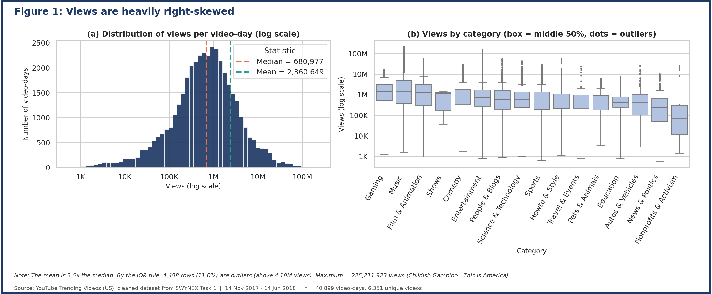
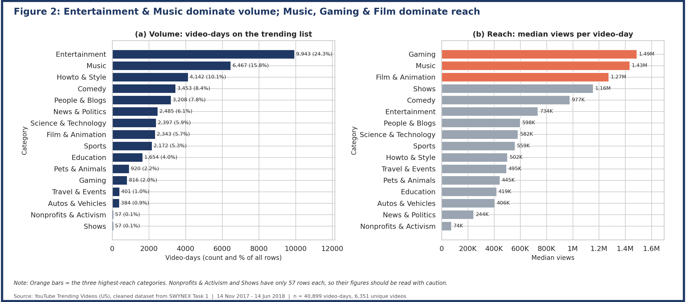
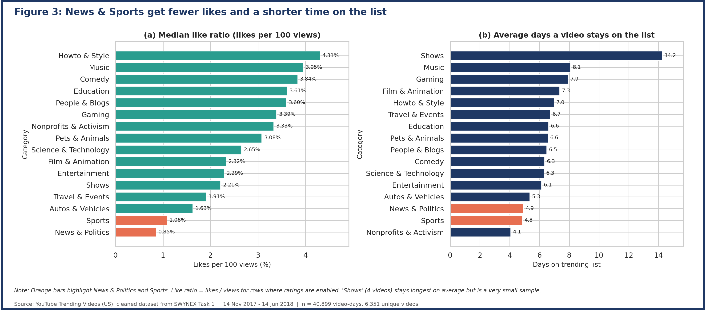
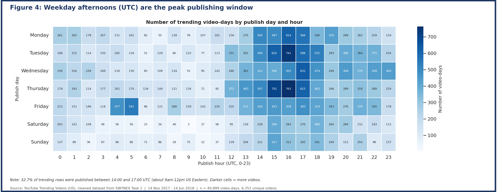
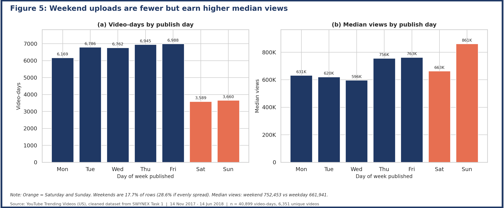
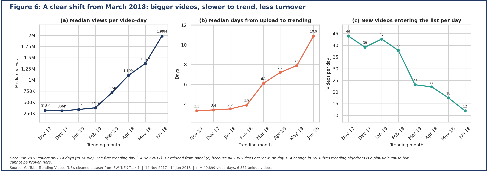
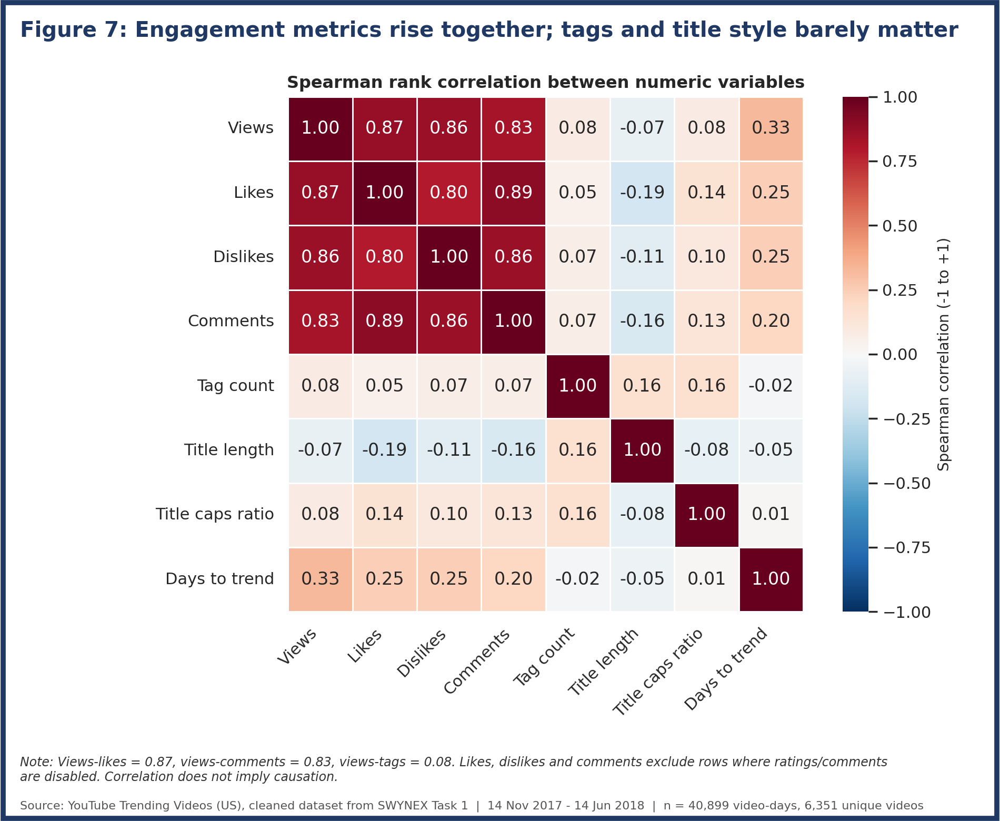
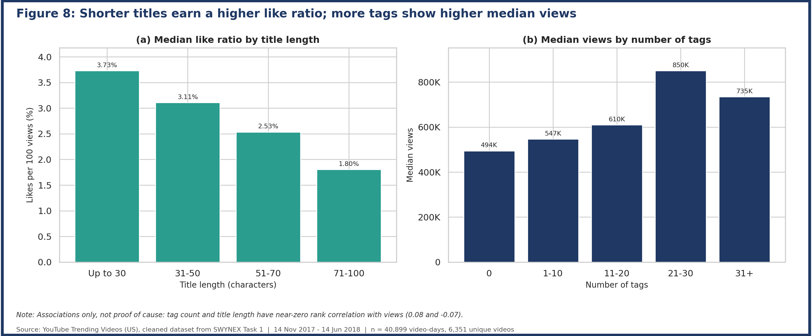
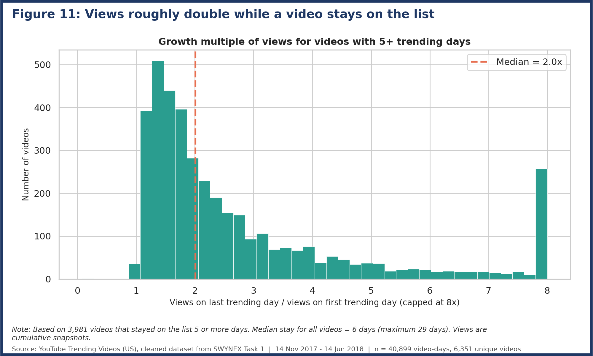
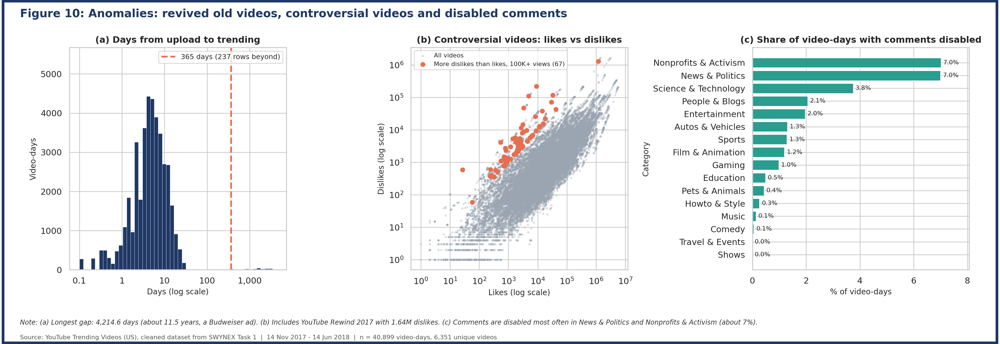

# SWYNEX – Exploratory Data Analysis (Task 2)

Exploratory analysis of the **cleaned YouTube Trending Videos (US)** dataset produced in Task 1, done in **Python** (pandas, matplotlib, seaborn). The goal: calculate key statistics, find trends, patterns and anomalies, and explain the insights with charts.

## Repository structure
```
README.md                              this file
requirements.txt                       Python packages
src/eda.py                             full, reproducible analysis script
data/youtube_trending_us_cleaned.csv   cleaned dataset from Task 1 (40,899 rows)
charts/                                11 report-ready figures (PNG, 200 DPI, bordered, numbered)
reports/                               summary tables (CSV), EDA_summary_tables.xlsx, EDA_Figures_Report.pdf
docs/SWYNEX_EDA_Report.pdf / .docx     full written report with all figures
docs/data_dictionary.md                description of all 25 columns
```
Run: `python src/eda.py` (needs `pandas`, `numpy`, `matplotlib`, `seaborn`, `openpyxl`).

## Dataset at a glance
| | |
|---|---|
| Rows (video-days) | 40,899 |
| Unique videos / channels / categories | 6,351 / 2,203 / 16 |
| Period | 14 Nov 2017 – 14 Jun 2018 (205 trending days) |
| Rows per day | ≈ 200 (the daily trending list has a fixed size) |

Each row is one video on one trending day, so a video appears once per day it stayed on the list.

**Key statistics** (full table in `reports/descriptive_statistics.csv`)

| Metric | Median | Mean | Max |
|---|---|---|---|
| Views | 680,977 | 2,360,649 | 225,211,923 |
| Likes | 18,247 | 74,579 | 5,613,827 |
| Comments | 1,912 | 8,581 | 1,361,580 |
| Days from upload to trending | 4.8 | 16.2 | 4,214.6 |
| Tags per video | 19 | 19.7 | 69 |

---

## Insights

### 1. Views are extremely skewed, so the median tells the real story
The mean (2.36M) is **3.5× the median (681K)**. About **11% of rows (4,498) are statistical outliers** (above 4.19M views by the IQR rule). The biggest, *Childish Gambino – This Is America*, has 225M views. Use medians, not averages, when describing a "typical" trending video.



### 2. Entertainment has the most volume, but Music, Gaming and Film earn the most views
Entertainment is **24.3%** of all rows and Music **15.8%**. But the highest *median* views are Gaming (1.49M), Music (1.43M) and Film & Animation (1.27M), about **2× Entertainment (734K)**. News & Politics has the lowest reach of the large categories (244K).



### 3. News and Sports get less love and a shorter life on the list
The median like ratio is only **0.85% for News & Politics** and **1.1% for Sports**, versus **4.3% for Howto & Style**. News and Sports videos also stay on the trending list the shortest (≈ 4.9 days on average vs 8.1 for Music). Quick-turnaround content gets watched, but it doesn't earn lasting engagement.



### 4. Timing: weekday afternoons (UTC) dominate, and weekend uploads punch above their weight
**32.7%** of trending videos were published between 14:00 and 17:00 UTC (about 9am–12pm US Eastern). Weekends make up only **17.7%** of trending rows (vs 28.6% if uniform), yet weekend-published videos have a **higher median view count (752K vs 662K)**. Less competition on weekends may help a video stand out.




### 5. The trending list changed around March 2018
From March 2018, videos got **bigger and slower**: median views rose from ~320K (Nov 2017) to ~2.0M (Jun 2018), median days from upload to trending rose from **3.3 to 10.9**, and new videos entering the list per day fell from **~44 to ~12**. In other words, the list became dominated by videos that stay for longer. A change in how YouTube builds the trending list is a plausible cause, but the data alone cannot prove it (June covers only 14 days).



### 6. Views, likes, comments and dislikes rise together, but tags and title style barely matter
Spearman correlation: views vs likes **0.87**, vs comments **0.83**. Tag count (0.08) and title length (−0.07) have almost no relationship with views. Still, **shorter titles get a better like ratio** (3.7% for ≤30 characters vs 1.8% for 71–100) and videos with 21–30 tags show a higher median than untagged ones (850K vs 494K). These are associations, not proof of cause.




### 7. A video's views roughly double while it stays on the list
For the 3,981 videos that stayed 5+ days, the median video had **2.0×** more views on its last day than on its first. The median stay is 6 days, 1,209 videos lasted 10+ days, and the longest lasted 29.



---

## Anomalies found


| Anomaly | What we found | File |
|---|---|---|
| Old videos revived | **237 rows** trended more than a year after upload; the extreme is a Budweiser ad that trended **4,214 days (≈ 11.5 years)** after upload | `reports/anomaly_old_videos_revived.csv` |
| Controversial videos | **67 videos** (≥100K views) have more dislikes than likes, often political (FCC net neutrality, Roy Moore). *YouTube Rewind 2017* had **1.64M dislikes** | `reports/anomaly_controversial_videos.csv` |
| View outliers | 4,498 rows above 4.19M views; Music is the largest share (40%) | `reports/anomaly_top_view_outliers.csv` |
| Comments disabled | Highest in News & Politics and Nonprofits (~7% of video-days) | chart above |

## Recommendations
- Report **medians and per-category figures**, not overall averages.
- Creators targeting trending should consider **weekend uploads** and **concise titles**.
- Compare periods before and after **March 2018** separately, since list behaviour changed.
- Treat News/Sports as short-lived traffic and Music/Gaming as sustained, high-reach content.

## Limitations
- Only videos that **made the trending list** are included, so results do not describe YouTube overall.
- Views are **cumulative snapshots** on each trending day, not daily views.
- US data from Nov 2017 – Jun 2018 only; June is a partial month.
- Correlations and group differences are not proof of cause.
